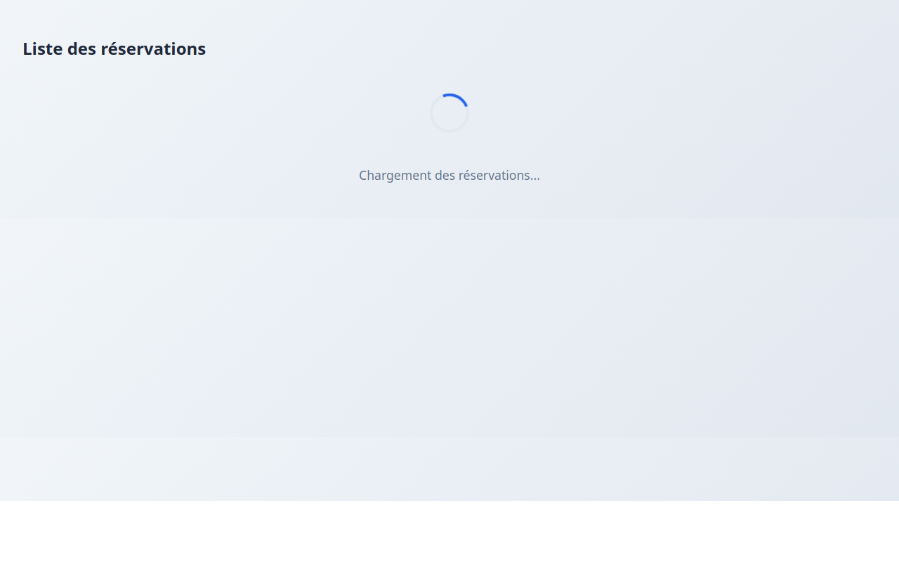
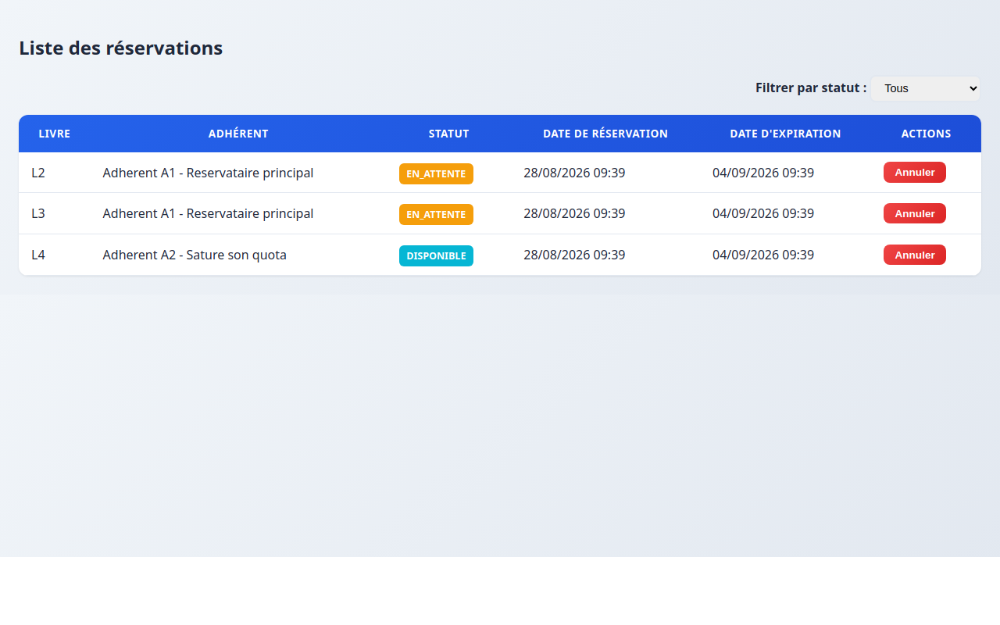
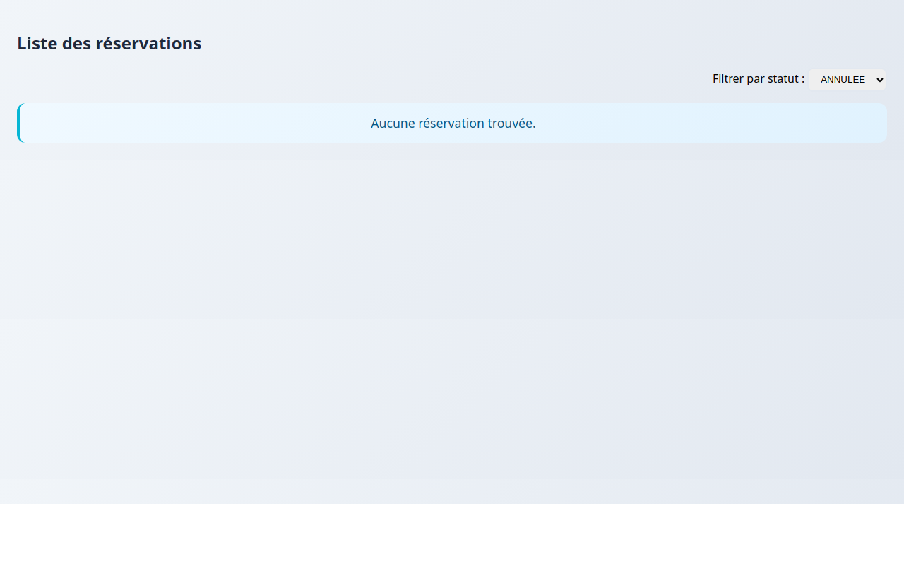
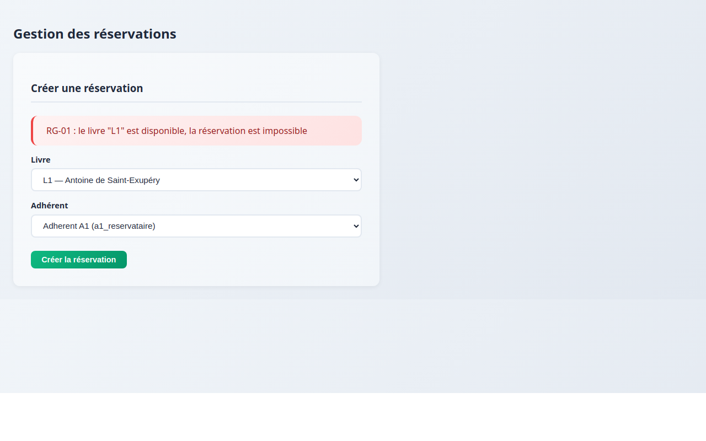

## Description

Interface UI du module réservation consommant le backend existant.

## Fonctionnalités

- Liste des réservations avec filtre par statut (Tous, EN_ATTENTE, DISPONIBLE, ANNULEE, EXPIREE, HONOREE)
- Formulaire de création avec dropdowns livre/adhérent et validation
- Annulation avec confirmation et affichage des erreurs 409
- Gestion des 4 états : Chargement, Données, Liste vide, Erreur
- Affichage des erreurs métier 409/400/404 avec messages du serveur
- Interface entièrement en français
- Design moderne responsive

## Captures d'écran

### État de chargement

### Liste remplie

### Liste vide

### Refus 409 affiché

## Architecture

- **Service dédié** : ReservationService (aucun HttpClient dans les composants)
- **3 composants** : Conteneur, Liste, Formulaire
- **Interface entièrement en français**
- **Design moderne** avec palette de couleurs vibrantes
- **Responsive** pour mobile et desktop

## Tests effectués

| Scénario | Résultat |
|----------|----------|
| GET /api/reservations | ✅ 200 |
| POST /api/reservations | ✅ 201 |
| PATCH /api/reservations/{id}/annuler | ✅ 200 |
| POST (livre disponible) | ✅ 409 avec message |
| POST (champ manquant) | ✅ 400 avec message |
| POST (inexistant) | ✅ 404 avec message |
| Erreur réseau | ✅ Message + Réessayer |
